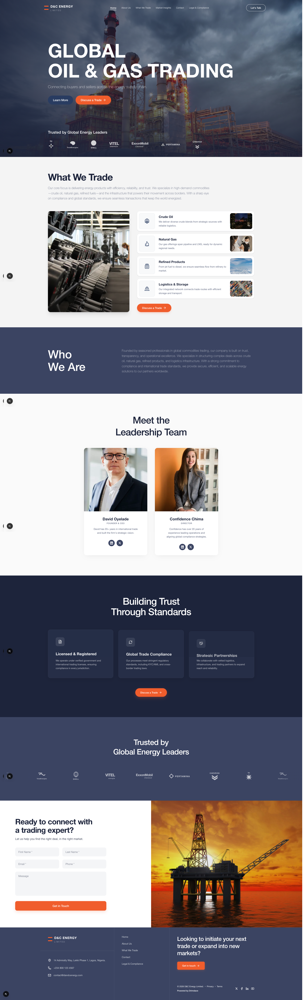
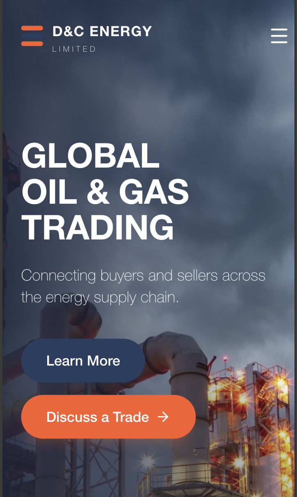

<div align="center">

# Global Energy Trading

A professional, minimal, and authoritative multi-page website for **D&C Energy Limited** — a global trading company operating across the oil, gas, refined products, and logistics sectors. Built with Next.js, Tailwind CSS, and GSAP for a Fortune 500-grade digital presence.

[](https://nextjs.org/)
[](https://tailwindcss.com/)
[](https://www.typescriptlang.org/)
[](https://greensock.com/)

</div>

---

## 🖥️ Desktop & Mobile Showcase





---

## Core Features

- **Cinematic Hero Sections**: Full-viewport hero banners with slow-pan background animations, layered gradient overlays, and staggered GSAP text reveals on every page.
- **Responsive Floating Navigation**: Transparent navbar that morphs into a pill-shaped, glass-blurred floating bar on scroll with active route highlighting.
- **Interactive Mobile Menu**: Full-screen overlay with staggered link animations and body scroll locking for seamless mobile UX.
- **Multi-Page Architecture**: Six fully-designed routes — Home, About Us, What We Trade, Market Insights, Contact, and Legal & Compliance.
- **Commodity Trading Cards**: Dedicated product showcases for Crude Oil, Natural Gas, Refined Products, and Logistics with iconography and imagery.
- **Trust & Social Proof**: Partner logo strip (BP, TotalEnergies, Shell, ExxonMobil, Chevron, Pertamina), leadership profiles, and compliance standards.
- **Contact System**: Multi-channel contact form, interactive FAQ accordion, and global office locations grid.
- **GSAP Animations Throughout**: Scroll-triggered reveals, staggered list animations, and micro-interactions powered by GSAP timelines.
- **Performance Optimized**: Built on the Next.js App Router with standalone output for container-ready deployments and superior loading speeds.

---

## Technology Stack

| Layer | Technology |
|---|---|
| **Framework** | Next.js 15 (App Router) |
| **Language** | TypeScript 5 |
| **Styling** | Tailwind CSS 4 |
| **Animations** | GSAP 3 + Motion |
| **Icons** | Lucide React |
| **Components** | React 19 |
| **Forms** | React Hook Form + Zod |
| **Utilities** | clsx, tailwind-merge, CVA |

---

## 📁 Project Structure

```
global-energy-trading/
├── app/
│   ├── layout.tsx              # Root layout with metadata
│   ├── page.tsx                # Homepage
│   ├── globals.css             # Design tokens & brand palette
│   ├── about/                  # About Us page
│   ├── trade/                  # What We Trade page
│   ├── insights/               # Market Insights page
│   ├── contact/                # Contact page
│   └── compliance/             # Legal & Compliance page
├── components/
│   ├── Navbar.tsx              # Responsive floating navigation
│   ├── Hero.tsx                # Cinematic homepage hero
│   ├── WhatWeTrade.tsx         # Commodity trading showcase
│   ├── WhoWeAre.tsx            # Company overview
│   ├── Leadership.tsx          # Leadership team profiles
│   ├── TrustStandards.tsx      # Compliance & standards
│   ├── TrustedPartners.tsx     # Partner logo strip
│   ├── Contact.tsx             # Contact form
│   ├── ContactHero.tsx         # Contact page hero
│   ├── ContactFAQ.tsx          # FAQ accordion
│   ├── ContactLocations.tsx    # Global offices grid
│   ├── FeaturedInsights.tsx    # Insights cards
│   ├── Footer.tsx              # Site-wide footer
│   └── ...                     # Additional section components
├── hooks/
│   └── use-mobile.ts           # Responsive breakpoint hook
├── lib/
│   └── utils.ts                # cn() classname utility
├── next.config.ts              # Next.js configuration
├── package.json
└── tsconfig.json
```

---

## Design System

The brand palette is defined as Tailwind CSS 4 theme tokens in `globals.css`:

| Token | Hex | Usage |
|---|---|---|
| `brand-primary` | `#293C61` | Primary navy — buttons, headers |
| `brand-secondary` | `#3B4462` | Secondary navy — card backgrounds |
| `brand-accent` | `#FA5D2B` | Vibrant orange — CTAs, highlights |
| `brand-dark` | `#1D243B` | Deep navy — page backgrounds |
| `brand-light` | `#F4F4F4` | Off-white — light sections |
| `brand-muted` | `#E5E5E5` | Muted grey — borders, dividers |

**Typography**: Helvetica Neue → Helvetica → Arial → sans-serif

---

## Getting Started

### Prerequisites

- Node.js 18+
- npm or yarn

### Installation

1. Clone the repository:
   ```bash
   git clone https://github.com/yourusername/global-energy-trading.git
   cd global-energy-trading
   ```

2. Install dependencies:
   ```bash
   npm install
   ```

3. Run the development server:
   ```bash
   npm run dev
   ```

4. Open [http://localhost:3000](http://localhost:3000) in your browser.

### Build for Production

```bash
npm run build
npm start
```

---

## Deployment

This project is optimized for deployment on **Vercel**. Connect your GitHub repository to Vercel for automatic deployments on every push.

The `standalone` output mode is also configured for Docker/container deployments.

---

## 📄 Pages Overview

| Route | Page | Description |
|---|---|---|
| `/` | Home | Cinematic landing with hero, commodities, leadership, and partner trust strip |
| `/about` | About Us | Company mission, vision, values, and corporate overview |
| `/trade` | What We Trade | Deep-dive into Crude Oil, Natural Gas, Refined Products, and Logistics |
| `/insights` | Market Insights | Industry analysis, market reports, and energy sector commentary |
| `/contact` | Contact | Multi-channel contact form, FAQ, and global office locations |
| `/compliance` | Legal & Compliance | Regulatory standards, legal notices, and compliance commitments |

---

## License

This project is open source and available under the [MIT License](LICENSE).
